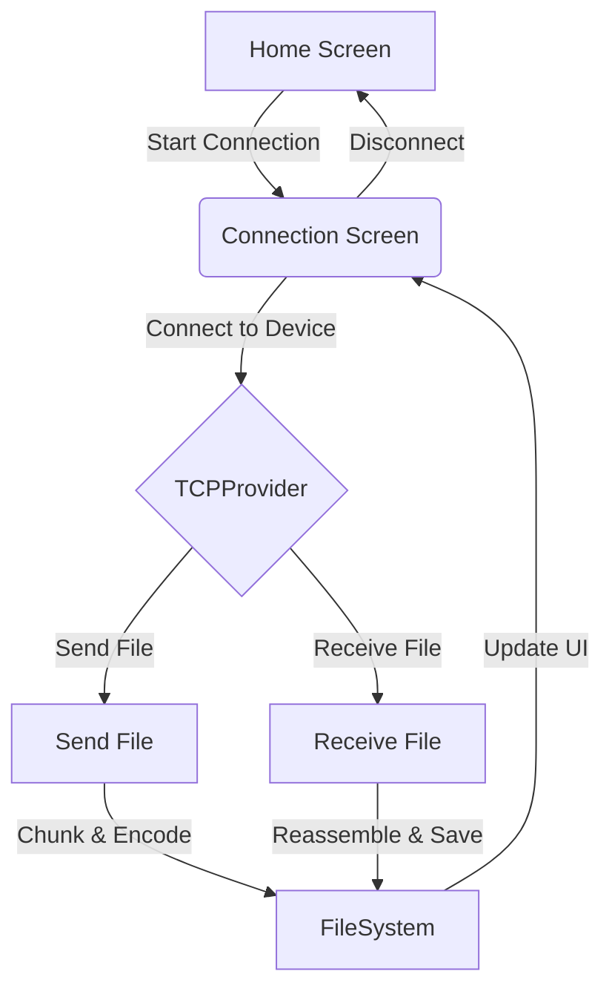

# File Sharing App

An Expo React Native application for seamless file sharing between devices using TCP sockets. This app allows users to send and receive files (images, documents, media) over a local network with a modern, intuitive UI.

## Features

- **Device-to-device file sharing** via TCP sockets
- **Send and receive** any file type (images, documents, media)
- **Live connection status** and transfer progress
- **Cross-platform**: Android & iOS support
- **Modern UI** with animated feedback

## Architecture & Flow Diagram



**Key Components:**

- `TCPProvider`: Manages TCP socket connection, file chunking, sending, and receiving logic.
- `ConnectionScreen`: UI for managing connection, sending/receiving files, and showing transfer status.
- `HomeScreen`: Entry point for starting a new connection or viewing received files.

## How It Works

1. **Connect Devices**: Users connect devices over the same network using TCP sockets.
2. **Send File**: Selected files are chunked, encoded in base64, and sent over the socket.
3. **Receive File**: Chunks are received, reassembled, and saved to device storage.
4. **UI Updates**: Progress and status are updated in real-time.

## Setup & Run

1. **Install dependencies**

   ```bash
   npm install
   ```

2. **Start the app**

   ```bash
   npx expo start
   ```

3. **Open on device**
   - Scan QR code with Expo Go
   - Use Android/iOS emulator

## Main Files & Structure

- `app/`: Entry points for screens (home, connection, send, receive)
- `components/Screen/`: UI screens for connection, sending, receiving
- `services/TCPProvider.tsx`: TCP socket logic, file chunking, transfer management
- `db/chunkStore.tsx`: State management for file chunks
- `assets/`: Animations, icons, images

## Example TCP Flow

1. **Connect**: `TCPProvider.connect(url, deviceName)` establishes a WebSocket connection.
2. **Send File**: `sendFileAck(file, type)` chunks and sends file data.
3. **Receive File**: Chunks are reassembled and saved using `generateFile()`.
4. **Disconnect**: Ends session and resets state.

## Screenshots & Demo

### App UI & File Transfer Screenshots

- **Building Screen**

   

- **Logo Screen**

   

- **Home Screen**

   

- **Send screen**

   

- **Receive screen**

   

- **Receive File**

   

- **scan QR**

   

## Contributing

Pull requests are welcome! For major changes, please open an issue first to discuss what you would like to change.

## License

MIT

## Get started

1. Install dependencies

   ```bash
   npm install
   ```

2. Start the app

   ```bash
   npx expo start
   ```

In the output, you'll find options to open the app in a

- [development build](https://docs.expo.dev/develop/development-builds/introduction/)
- [Android emulator](https://docs.expo.dev/workflow/android-studio-emulator/)
- [iOS simulator](https://docs.expo.dev/workflow/ios-simulator/)
- [Expo Go](https://expo.dev/go), a limited sandbox for trying out app development with Expo

You can start developing by editing the files inside the **app** directory. This project uses [file-based routing](https://docs.expo.dev/router/introduction).

## Get a fresh project

When you're ready, run:

```bash
npm run reset-project
```

This command will move the starter code to the **app-example** directory and create a blank **app** directory where you can start developing.

## Learn more

To learn more about developing your project with Expo, look at the following resources:

- [Expo documentation](https://docs.expo.dev/): Learn fundamentals, or go into advanced topics with our [guides](https://docs.expo.dev/guides).
- [Learn Expo tutorial](https://docs.expo.dev/tutorial/introduction/): Follow a step-by-step tutorial where you'll create a project that runs on Android, iOS, and the web.

## Join the community

Join our community of developers creating universal apps.

- [Expo on GitHub](https://github.com/expo/expo): View our open source platform and contribute.
- [Discord community](https://chat.expo.dev): Chat with Expo users and ask questions.
